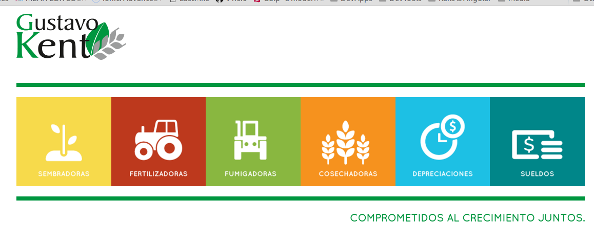

# La tierra de los desocupaches
  Un mundo donde cada uno es dueño de lo mas preciado que tenemos: la libertad
##01-03-2015
  Vuelvo a escribir en el blog de desarrollo de AppUU luego de un febrero bastante pobre en avance concreto para el proyecto. Gran parte se debe al desarrollo de otra app que ya quedo terminada y funcionand, LastMile (LM). Una aplicación para el armado de reportes. El desarrollo de LM fue muy importante ya que me permitio conocer a fondo algunas librerías de node, como Gulp, con la cual quede muy satisfecho. Toda la aplicación cliente la escribí con AngularJS + Coffee + SASS + JADE todos estos compiledores en combinación con Gulp funcionan muy bien y permiten escribir apps con menos lineas de codigo.

  

  Por otra parte termine el curso para MEAN developer (Angular, Express, Node, MongoDb) que meresulto muy útil y clarificante de que puedo hacer con esas herramientas. Queda pendiente hacer el curso de IONIC que me serviría para las apps mobiles (Angualar y iOS).

  Por otra parte hoy converse a la mañana con alguien que este desarronando herramientas la gestión de agro y que persigue objetivos alinieados con los mios.
  Aca va un resúmen de lo que hablamos

  _Muy copado lo que me mostraste hoy, las herramientas que fuiste desarrollando para dar solución (velocidad, orden y estándares) a problemas con los que habitualmente te enfrentas. En este aspecto, hay 2 tipos de personalidades (a mi parecer). Los que se quedan en el molde con las herramientas que reciben y no se salen del libreto (hago lo que me pide mi jefe sin cuestionar y no voy mas allá) y los que ante un problema/situación que se repite frecuentemente preferimos parar la pelota y pensar un solución más eficiente, más de fondo, que nos ayude a eliminar las tareas que son repetitivas y que podría estar haciendo una maquina (sistema) para liberarnos tiempo que podemos dedicar a aportar valor agregado en el negocio, en nuevas estrategias o inclusive poder estar más tiempo con la flia. y amigos.  Esto te lleva a "perder/invertir tiempo" en un principio, porque tenes que poner mucha cabeza, pero en mediano / largo plazo son las soluciones que aportan valor. Estoy convencido que la próxima "revolución" del agro va de la mano de estos sistemas. Realmente me dio gusto saber que hay otras personas con objetivos similares, buscando soluciones simples que (aún no existen o no la conozco) para la administración y negocio agropecuario._  


##18-01-2015
  Bella Visa,
    En el proceso de emprender hay que ser muy cuidadoso con quien compartimos el trabajo. Y no lo estoy diciendo porque alguien pueda robarlo (las ideas sin implementación no valen nada), lo digo por otra cosa. Muchas veces uno esta entusiasmado en compartir y mostrar lo que uno viene haciendo, sin embargo un de ser cauto en con quien comparte ideas, ya que como emprendedor es fundamental mantener la motivación alta, sin motivación dificilmente uno logre el objetivo. Para lograr eso necesitamos compartir el trabajo con aquellos que tengan la capcidad técnica de apreciar y también criticar nuestro trabajo. Por ejemplo, el estado actual de app2u, donde hay mucho códig pero la UX no esta bien desarollada debería ser razón suficiente para no mostrarlo a los usuarios finales, ya que ellos la primera impresión es única y es principalmente visual. Si podría compartir con otros desarrolladores, de todas alcarando que la UX es lo último que haremos que lo que queremos compartir es determinada función, algoritmo, lógica.
     La primera impresión es fundamental y solo hay tenemos una oportunidad para que sea positiva.


##15-01-2015
 Hacia allá vamos!!
 

## 14-01-2016

Martinez, pasamos dos dias en lo de los viejos porque Flo tenía que hacerse unos estudios de rutina por Bauti! Todo bien por suerte. En estos dos días no avance demasiado en cuanto a código (sí resolví unos cuentos bugs) pero sí en ideas fuerza.   La navegación, quedo reflejada en un issue de GitHub y lo mismo para las condiciones de pago. Son simples y bastante intuitivas.

Luego de mucho laburo e investigación, deje implementado los fixtures y saque la librería factory girl! Demasiada magía para mí. Los fixtures son más simples y al ser un fiel reflejo de la base de datos son transparentes. Para poder testear bien tenés que poder confiar en que la info. es la que indicaste. Si dudas de los datos contra los que testeas estas al horno!

# Appuu Develoment History
## 12-01-2016
  ### Aprender algo nuevo cada día es avanzar
  Otra clave para que un proyecto sea exitoso es tomarse un tiempo todos los días para aprender algo nuevo. Esto puedo ser profundizar un tema ya conocido o iniciarse en algo nuevo. El desarrollo de apps se mueve muy rápido y las nuevas tecnologías parecen desplazar a las viejas en poco tiempo. Como mantenerse ante tales cambios?  Tener una esctructura chica y flexible es una de las claves, ya que te permite hacer cambios radicales a bajo costo.
  Sin ir más lejos, hoy aprendí como traba Gulp un task manager en JS que por lo visto es muy eficiente y parece bastante intuitivo. Me termino de definir cuales son los pasos que si o si voy a tener que dar... App2u tiene que estar separada en back-end y front-end explicitamente.. vivir como dos proyectos separados. Gulp va a reemplazar al Asset Pipiline de Rails en servivir los assets. Lo hace mejor y con  una orientación más moderna. Parece que hoy todo es Javascript. Sin embargo la API seguira siendo en RoR, la flexibilidad, simpleza y poder que tiene Ruby, junto con ActiveRecord es un activo que creo que va a perdurar al menos en el mediano plazo y por eso no voy a cambiar esto.
  Pero definitvamente el front-end debe ser moderno, con angular2, gulp, boostrap4 para ser competitivo.. Son cambios que voy a tener que hacer pero primero necesito terminar la primera fase y tener un producto funcionando.

Que aprendí hoy?
  * Gulp
  * Ecma2015 - codeschool (let y const)
Que desicion tomé?
  * App2U = App2U-API + App2U-CLI
Que avance hice en APP2U?


## 11-01-2016
  ### Barajar y dar de nuevo
  Luego de unos días de descanso en Mar del plata y Pinamar vuelvo al ruedo con App2U, con mucho entusiasmo. Sin embargo es en un momento crítico del proyecto, si tuviera que describirlo con una imagen sería con esta: 

  El barco ya zarpo, navego durante dos meses con vientos favorables y ahora se encuentra en el medio del océano. Son los momentos más duros para un empendimiento, donde la ansiedad por avanzar puede jugar en contra, donde surgen las dudas y los miedos por no ver tierra firme. Sentirse a la deriva y pensar que uno no puede guiar el barco por falta de referencias claras puede llevar a la paralisis. STOP!!!!
  Aca es donde el soporte y apoyo de los que creén en uno es fundamental, es la brisa que nos empuja hacia adelante y nos permite volver a tener el control, volver a guiar el velero al próximo punto firme. Dos claves para este momento: la primera es hablar, sacar esas ansiedades, miedos y dudas, pasan a ser pequeñas cuando logra exteriorizarlas. Contarlo a las personas que te apoyan (incondicionalmente), a vecés uno solo necesita saber que hay un red y que puede lanzarse tranquilo ya que en el peor de los casos terminara en esa red. La segunda clave es seguir avanzando, pequeños exitos diarios, no buscar en el horizonte la tierra sino guiarse por la brujula y al mapa que uno trazo al partir y confiar en que uno de estos días tendrá tierra a la vista. Paso a paso

## 29-12-2015
  Si todo los días aprendo (real) algo nuevo las chances lograr mis metas aumentan exponencialemente, es exponencial ya que el conocimiento no solo es útil en si mismo sino que genera __confianza__ que es el red bull de cualquier emprindimiento, ese apalanzamiento es el que hace que la ecuación sea exponencial! El aprendizaje es como un crique que agranda el arco/cancha(caso de tennis) para patear el penal..  

## 28-12-2015
  La factura ya genera asientos ! ;) :+1:
  Se puede seleccionar el iva dinamicamente en la misma, lo cual permite tener menos productos.. ej: gastos telefonicos.. podes cargar 3 items y cada uno on un iva distinto sin necesidad de tener tres productos.

  otro tema asociado al anterior: _volviendo a las bases de SIMPLEZA_ :bulb: los productos solamente tienen un iva, no hay iva compras y ventas.. los casos a los cque aplica esto son mínimos y se pueden resolver con el desarrollo del punto anterior.

## 18-12-2015
  La factura ya esta funcionando tengo que lograr que hoy genere un asiento...

## 14-12-2015
Sin dormir muy bien ya hace unos dias a causa de Facu (El Matafuel Pitales Esteves) que se instalo en nuestra cama que ya para cuetro queda chica. Cuesta arrancar la semana, de hecho son las 1030 y recien empiezo a mover, no importa vamos a ponerle toda la garra..
Para hoy
* Facturas de compra.. que generen asientos
* Implementar Input Mask

_y vio que era bueno...
Que placer es agregar una alidacion en un modelo anidado como items de faccturas y que con esa linea de codigo ya funcione todo (interface logica etc). Es la recompenza de prgramar pensando en reutilizacion de codigo! :+1:_


## 11-12-2015
Hoy tengo que trabajar para un cliente (el aguara) pero me cuesta deterner el avance. Esta semana entre los feriados (lunes y martes) mas el virus que tuvimos no fue tan productiva como hubiera querido. Por otra parte me ayer me pidieron una visita a Uruguay y otra a Tandil. Es  muy bueno teener trabajo pero tambiñen a veces te hacen perder el envión que traías. De todas maneras los objetivos estan claros.. AppUU se libera en Abril, con la llegada de Bauti que trae el pan bajo el brazo.

### Que es appUU ?


Es tu administració en la nube :cloud:

Vas a ganar tiempo :clock1:, esa es nuesta misión.

Nos comprometemos a trasladar las soluciones generadas en esta  plataforma de manera simple e intuitiva para que el tiempo invertido en pensar y desarrollar una nueva funcionalidad sea aprovechado por miles de empresas y no que quede limitado a una. La mayor parte de los problemas, los más habituales para cada negocio / rubro, ya tienen solución, para administrar nuestra empresa no tenemos que ser magos sino saber donde buscar la información y ejecutarla. Cuanto menos tiempo :clock2: perdamos en esa tarea (buscar y ejecutar ) mayor productividad tiene nuestra empresa.
De las alternativas efectivas para resolver un problema creemos que la __Simple__ es la mejor. Por eso nos enfocamos en buscar esa solucion para vos.  


Cualquier empresa, emprendimiento, profesional, va a tener acceso a una forma de administrar más eficiente.


## 10-12-2015
  Hoy asume Mauricio!! es hoy es Ahora!!
  En la mañana trabaje actualizando los specs y realmente, por mas que lleve mucho tiempo (en particular al principio), la seguridad que genera ir teniendo buenos test para refactorizar vale cada segundo invertido. Por otra parte es una gran ayuda para el diseño de la aplicacion..
  Hay que testear lo que importa!! Siempre la interface publica.. cada objeto tiene que tener un API fuincional y util.. no hay que llenarla de metodos porque si. Es una bola de nieve

  __En que estoy__ Ya genere una primer compra.. tuve inconvenientes con los wrappers de rails..  pero finalemente puede solucionarlo. Lo que tengo pendiente para hoy es re-definir los scopes a 3
  * Usuario: [notas, perfil, etc]
  * Empresa: [models que tienen la  columna empresa_id... casi todas transacciones]
  * Shared: [aquellos que son compartidos y generados por la comunidad.. uno puede elegir verlos o no]


## 9-12-2015
Ahorro o inversión
  Cuando uno empieza a gastar sus ahorros en el proyecto, uno esta invirtiendo en algo que cree. Entonces no debería estar esa traba psicologica , es barrera, de pensar estoy quemando las fihchas en esto y si...?  Es pregunta es letal, conduce a la duda y al miedo.. y ya sabemos, porque nos los ha remarcado Yoda a lo largo de nuestra vida, que el miedo conduce a lado oscuro. Etonces, si vas a emprender, creetela sos un empresario, no en potencia ya lo estas siendo y estas administrando tus recursos para alcanzar un objetivo.. no lo veas como un gasto sino como una inversión.. y como tal hay que gestionala inteligentemente...
  ahhh otra cosa.. si tenes que pagar algo pagalo y ya.. sacalo del sistema.. tenes que liberar espacio para desarrollar tu poyecto.. no lo ocupes con cosas que tarde o temprano vas a tener que hacer !! es postergar lo inevitable y cargarse de preocupaciones.. en la balanza salis perdiendo.. cancela tus deudas y trabaja tranquilo


## 05-12-2015

Acerca de los buenos sistemas

Que diferenciaun sistema de un sistema excelente ??

Sus algoritmos!! Su interface orientada a la productividad y felicidad del usuario!!

Un sistema, por mas que le pongamos de nombre una siglas que asusten y nadie entienda en definitiva a donde van ocn eso, si no tiene buenos algoritmos pensados con el objetivo de solucionar problemas comunes, es ni mas ni menos que una base de datos con una linda ( o no interface)..
Las grandes empresas de software se destacaron por su simpleza al uso, pero con gran inteligencia en los algoritmos detrás...

Hoy estamos al revés implementar un sistema es caro, no sabes que tiempo nos va a llevar y luego nos quedamos atados al mismo porque, si ya invertimos tanta plata o tiempo ...no podemos salir.. sería asumir como perdida esos recursos invertidos?   Es como estudiar una carrera y luego dedicarse a otra cosa (MF)


nada mas!

## 04-12-2015

Acerca de la responsabilidad: Que es ser responsable?

Es cumplir los objetivos que me pone el contexto, trabajo, sociedad estandares ?
Uno podría tildar al emprendedor de ser irresponsable, ya en un muchos casos deja seguridad del trabajo actual para embarcarse hacia una aventura desconocida. En ese procesos hay etapas
1) la inquietud:
2) la desicion: Aca es donde empiezan las preguntas (bien intencionadas) de la gente que nos quiere y queire lo mejor para nosotros. ¿ Estas seguro ? Mira que esta dificil, y tu flia como le vas a dar de comer??   De alguna forma nos traslada sus propios miedos. Uno puede verse acobardado por eso y decidir con lo que venía haciendo.  En una sana medida estos hechos nos permite equilibrar las fuerzas que estan jugando (lo hago --> <-- no lo hago) y tomar una mejor desición ya que si uno a pesar elige a pesar tener una gran resistencia (miedos, entorno, consejos, miedos, miedos), por una cuestión de física, la fuerza emprendedora esta muy latente dentro nuestro y hasta podría arriesgar que se retroalimenta con los intentos de empezar algo.
3) El miedo: merece un capitulo aparte.
desarrollar

3) LLevar adelante: las trabas   


## 19-11-2015

Securing API: luego de varios intentos frustantes de testear controllers y request utilizando los helpers de Devise sin exito, logre loguearme en un rspec basandome en los ejemplos de devise_token_auth (carpeta test) que utilizaban Warden y headers para lograrlo.

cree un modulo con helpers para facilitar el menejo de login en los tests

		module LoginHelpers
			def login_user
				before(:each) do
					@resource = create(:usuario)
					@auth_headers = @resource.create_new_auth_token

					@token     = @auth_headers['access-token']
					@client_id = @auth_headers['client']
					@expiry    = @auth_headers['expiry']

					age_token(@resource, @client_id)
					get '/ba/organizaciones', {}, @auth_headers

					@resp_token       = response.headers['access-token']
					@resp_client_id   = response.headers['client']
					@resp_expiry      = response.headers['expiry']
					@resp_uid         = response.headers['uid']
				end
			end

			def age_token(user, client_id)
				if user.tokens[client_id]
					user.tokens[client_id]['updated_at'] = Time.now - (DeviseTokenAuth.batch_request_buffer_throttle + 10.seconds)
					user.save!
				end
			end

			def expire_token(user, client_id)
				if user.tokens[client_id]
					user.tokens[client_id]['expiry'] = (Time.now - (DeviseTokenAuth.token_lifespan.to_f + 10.seconds)).to_i
					user.save!
				end
			end


		end

Ahora puedo continuar con el escenario donde ingreso por primera vez ( o sin empresa asociada) y appuu (quien? que personaje va a ser? me ofrece crear una nueva empresa, ver mis invitaciones o solicitar inviataciones.

----------------
## Navegacion

debe haber una barra fija superior con
Logo de appuu - input largo - perfil de usuario

input es un buscador generalizado.. con las siguiente caracteristicas

# ABMS
@ Cumnicacion o buscar personas para tarea
? Help y Wikis
& Operaciones
* Informes

-------------

## 09-11-2015

### Personajes reales como clases - Una idea revolucionaria, por lo menos para mi

*Ayer me surgio la siguiente idea, luego de estar largamente pensando y leyendo acerca de la prog. orientada a objetos, appuu es como un estudio de administración virtual, y como tal debe tener asesores profecsionales para cada tarea. En linea con el principio de single-responsability que deben tener las clases, en donde las clases activeRecord tienen ya una responsabilidad muy definida que es la de persistir los datos, se me ocurre la idea de tener estos personajes profesionales. Ellos van a se clases, voy a tener una class Contador que se encargara de llevar la conabilidad, los asientos, los impuestos, el sera el responsable de lidiar con la logica contable. Tendremos una secretaria cuyas tareas imitaran las de una secretaria real, agenda, contactos, etc, un financista y un generente*

Este escenario se acerca mucho a la realidad de una empresa y por lo tanto va a representar mejor los probleams a los que se entrentan las pequeñas empresas las familias interprestadas como empresas. Luego se podrá trasadar al agro donde deberemos contar con una clase Veterinario y un Agronomo para asistirnos en las tareas propias de la actividad.

### Yendo al tema de hoy y al trabajo de esta semana
- Obj: Crear y terminar el formuleador. El encargado de armar los fromularios utilizando los metadatois que surgen de las tablas + un diccionario con info adicional que se encuentra en en formato YML !
- Limite 11-9-2015

**Me cuesta mantener las convenciones propias en nombre de clases en ruby y también en js. Hay una mezcla importante de metodos en ingles (para mantener la convencion de RoR ) [new, create, detroy, etc] y en castellano que es inevitable. Pero a veces pienso que sería más práctico escribir el codigo de la app en ingles, quedaría más prolijo y fácil de entender**

### Donde ubicar las clases que no son activeRecord
*Por lo que leí las mismas deberían estan en la careta __LIB__. Me parece que seria bueno como para marcar una difencia entre esos dos grandes grupos*

## 11-09-2015

Los strong parameters de los controladores de rails envuelven (wrapper) a los params que llegan con el nombre del modelo del controlador. En un controlador Ba::OrganizacionesController si creo la funcion
```ruby		
		def organizacion_params
			params.require(:organizacion).permit(:bla, :ble)
		end

cuando mande al controlador {nombre: 'jose'} va a ser transformado por paramsWrapper en {organizacion: {nombre: 'jose'}} .. Toma el nombre de la clase, le saca Controller luego aplica una funcion llamada demodulize (quita el modulo) y underscore ...
algo asi

	 'Ba::Organizacion'.demodulize = 'Organizacion'
	 'Organizacion'.undersore = 'organizacion'

## 18-11-2015

Beautifull controllers: basandome en el libro Growing rails apps, hice un estandar para los controladores de rails. Con las funciones basicas de CRUD y utilizando private functions y hooks para facilitar la lectura del codigo. Las collecciones y los items quedan restringidos a un scope (que por ahora es == a all) que sirve de control por usuarios aún no implementado.
